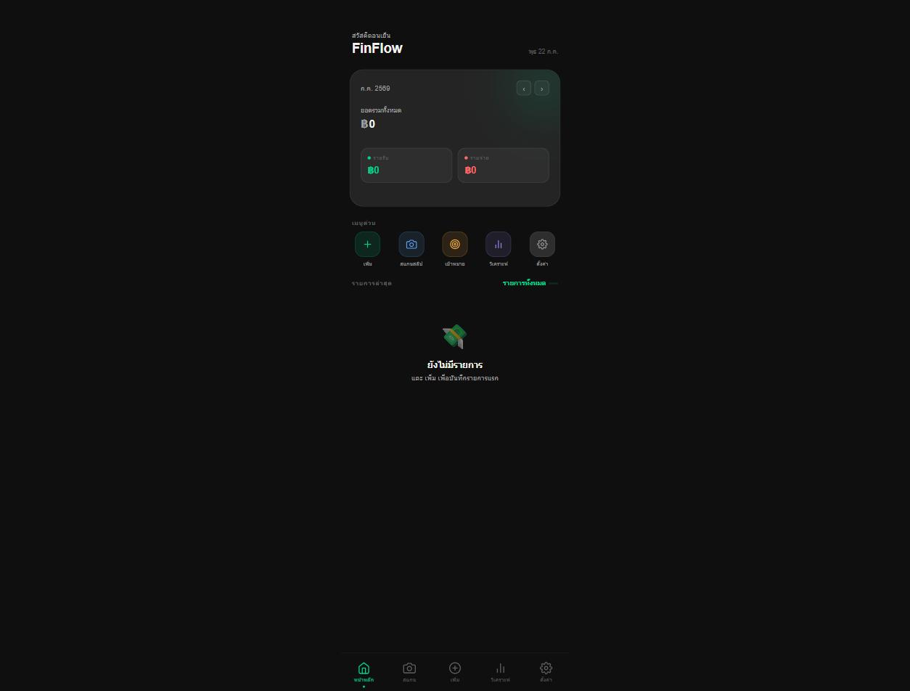

# FinFlow

A mobile-first personal finance tracker — single-page, client-side only, installable as a home-screen PWA. No backend, no account, no server: everything lives in the browser's `localStorage`.

**Live demo:** https://prapachaiuea.github.io/My-finance-app/



## Features

- **Dashboard** — monthly balance, income/expense summary, budget progress bar
- **Slip scanning** — upload a bank transfer slip (KBank Make, Bangkok Bank, or generic) and auto-extract the amount via OCR ([Tesseract.js](https://github.com/naptha/tesseract.js)), instead of typing it in by hand
- **Transactions** — add, categorize, and browse income/expense history, including recurring entries
- **Analytics** — spending-by-category donut chart and budget-vs-target tracking
- **Savings goals** — set a target, track progress, log contributions
- **Custom categories**, light/dark theme, and full **Thai/English** localization

## Tech stack

Vanilla HTML/CSS/JS in a single file — no build step, no framework, no dependencies beyond Tesseract.js (loaded via CDN for OCR). State persists to `localStorage` in the browser.

## Running locally

Just open `index.html` in a browser, or serve the folder with any static file server:

```bash
python -m http.server 8000
```

## Deployment

Static hosting via GitHub Pages, served directly from `main`.
